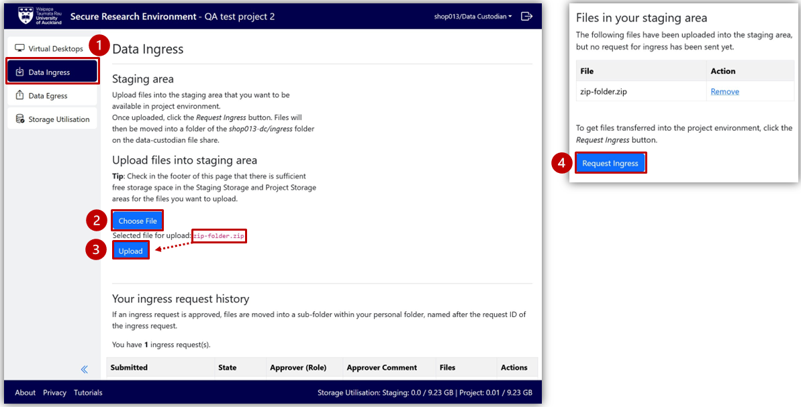
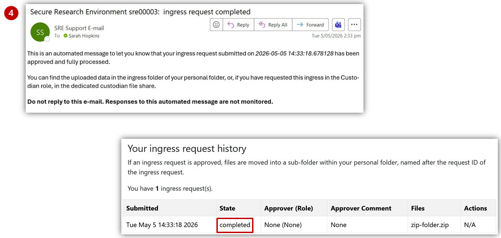
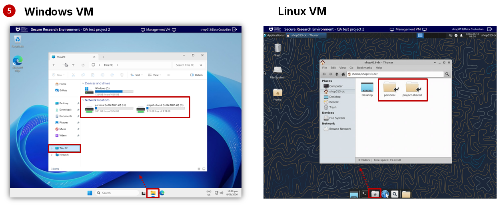

# As a Data Custodian 

## Import (ingress) data directly into the SRE

A data custodian can import (ingress) data and files directly into the Secure Research Environment (SRE) without requiring approval from the ingress approver.

<ol>
  <li>
    Select <strong>Data Ingress</strong> from the left-hand project menu
  </li>
  <li>
    Select <strong>Choose File</strong> to find a file from your computer
    

      You can zip up files to upload multiple files at once
    
  
  </li>
  <li>
    Once displayed, select <strong>Upload</strong> to copy your file to the staging area
    

      Review <strong>Storage Utilisation</strong> from the left-hand project menu, or in the bottom-right of the Project Dashboard, to confirm sufficient free storage space in the staging are and Project Storage.
    

  </li>
  <li>
    Select <strong>Request Ingress</strong>
    

      This moves the file(s) from the staging area, and an email is sent to you to confirm your completed ingress request. You will see the new ingress request in <strong>Your ingress request history</strong> with the request State showing as <em>completed</em>. <strong>Note:</strong> All files are virus-scanned before being moved from the staging area.    
    

  </li>
</ol>

<figure markdown>
  
  <figcaption> </figcaption>
</figure>

<figure markdown>
  
  <figcaption> </figcaption>
</figure>

<ol start="5">
  <li>
    The files will be moved into a timestamped folder within the ingress sub-folder of your personal Data Custodian (<code>username-dc</code>).
    <ul>
      <li>
        <strong>Windows VM:</strong>: Click on the File Explorer from the taskbar at the bottom of the virtual desktop. Select <strong>This PC</strong> to display available folders within “Network locations”. Select <code>data-custodian > [username]-dc > ingress</code>.
      </li>
      <li>
        <strong>Linux VM:</strong> Click on <strong>File Manager</strong> from the taskbar at the bottom of the virtual desktop. Select <code>project_data > data-custodian > [username]-dc > ingress.</code>
      </li>
    </ul>
  </li>
</ol>

<figure markdown>
  
  <figcaption> </figcaption>
</figure>

## File and data management

A Data Custodian can access and manage data and file(s) across the project storage locations to ensure that data and associated files are shared only with appropriate project team members.

Possible project actions include:

<ul>
  <li>
    Store <strong>source (raw) project data</strong> to the <code>project-ro</code> folder. The content of this folder cannot be edited by other users, but a researcher can make a working copy for analysis. Any shared project data or files that can be modified by all users can be stored in the <code>project-rw</code> folder.
  </li>
  <li>
    Store files that need to be accessed by a specific project member to their <strong>project-personal</strong> folder, usually named <code>[username]-r</code>.
  </li>
  <li>
    Store files that need to be accessed by a project sub-group to a customised folder, as appropriate.
  </li>
  <li>
    Delete data and files from shared and personal project folders, as appropriate.
  </li>
</ul>

A Data Custodian can view data and files within the ingress-approver and egress-approver folders. This enables file storage visibility and allows the Data Custodian to view progress of pending ingress/egress requests.

## Export (egress) data directly out of the SRE

A Data Custodian can export (egress) data and files directly out of the Secure Research Environment (SRE) without requiring approval from the egress approver.

<ol>
  <li>
    Open your personal folder <code>[username]-dc</code> on the <strong>Virtual Desktop</strong> and copy the file to be downloaded into the <code>egress</code> subfolder.
    

      All files in the <code>egress</code> sub-folder will be copied to the staging area when a request is submitted. If you have file(s) from an earlier egress request in this folder, please delete those files before submitting a new request.
    

  </li>
  <li>
    Return to <strong>Data Egress</strong> on the Project Dashboard.
  </li>
  <li>
    Select <strong>Request Egress</strong>.
    

      The file(s) will be available for download, and you will receive an email confirming your completed egress request. The egress request will be listed in <strong>Your egress request history</strong> with the request State showing as <em>completed</em>.
    

  </li>
  <li>
    Select the file link under <strong>Files available for download</strong>.
  </li>
  <li>
    Go to the <code>Downloads</code> folder on your local computer to access the file(s) and move them to a secure storage location (e.g., a project Research Drive).
  </li>
</ol>

## Request project changes

### Request for change of user's role/permission level

A Data Custodian can request for a specific user’s role to be changed within a project or give them a different permission level (read-write or read-only) in SRE. To request, please send an email to the SRE team.

### Request to add/remove a user from the project

A Data Custodian can request for a specific user to be added or deleted from the project in SRE. Please send an email to the SRE team with the users' details – full name, USERNAME, email and role in SRE (researcher/data custodian/ingress-approver/egress-approver).