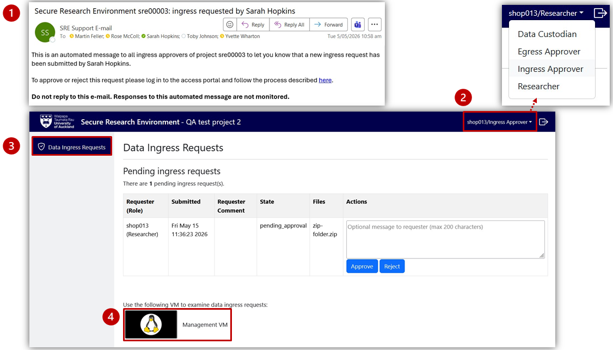
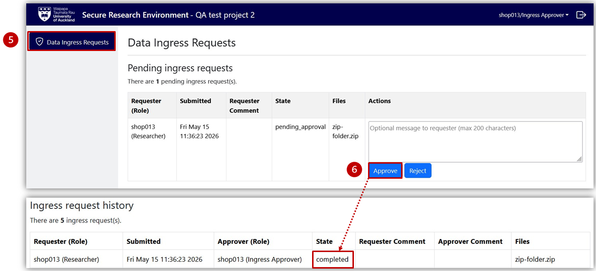

# As a Data Ingress Approver 

As an Ingress Approver, use Data Ingress Requests to check and approve files(s) that a Researcher wants to import into the project environment. 

## View ingress requests 

<ol>
  <li>
    You will receive an email informing you of an Ingress Request to approve.
  </li>
  <li>
    Log in to the SRE and, if needed, change to the <strong>Ingress Approver</strong> role.
  </li>
  <li>
    Select <strong>Data Ingress Requests</strong> from the left-hand project menu on the Project Dashboard.
  </li>
  <li>
    Use the <strong>Management VM</strong> to view and inspect the file(s).
    <ul>
      <li>
        <strong>Windows VM:</strong> Click on the File Explorer from the taskbar at the bottom of the virtual desktop. Select <strong>This PC</strong> to display available folders within "Network locations". Select <code>ingress-approver > [username]-r (user who made the request).</code>
      </li>
      <li>
        <strong>Linux VM:</strong> Click on the <strong>File Manager</strong> from the taskbar at the bottom of the virtual desktop. Select <code>project_data > ingress-approver > [username]-r</code> (user who made the request).
      </li>
    </ul>
  </li>
</ol>

<figure markdown>
  
  <figcaption> </figcaption>
</figure>

## Approve or decline a request 

<ol start="5">
  <li>
    Return to <strong>Data Ingess Requests</strong> on the Project Dashboard.
  </li>
  <li>
    <strong>Approve</strong> or <strong>Reject</strong> the ingress request.
    

      The request State in <strong>Ingress request history</strong> will change from <em>pending_approval</em> to <em>completed</em>. The files will be automatically deleted from the staging area following approval or rejection.
    

  </li>
</ol>

<figure markdown>
  
  <figcaption> </figcaption>
</figure>