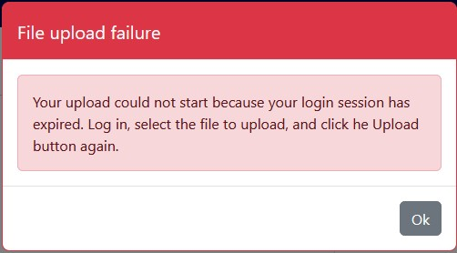
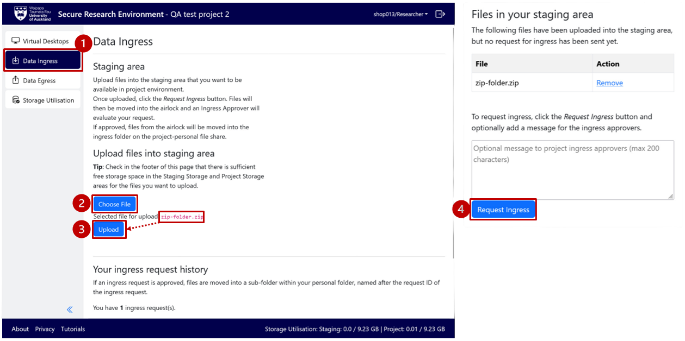
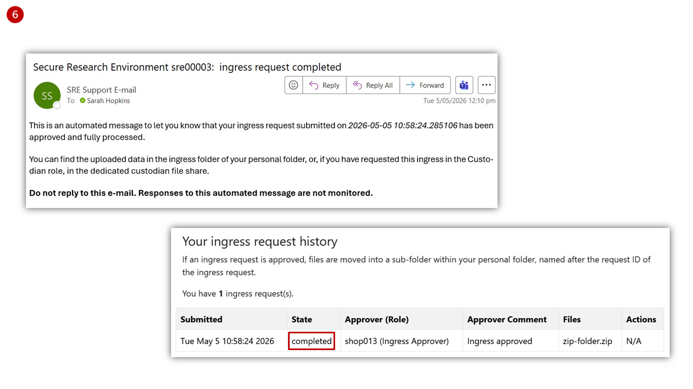
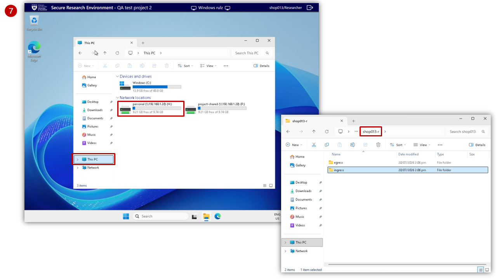
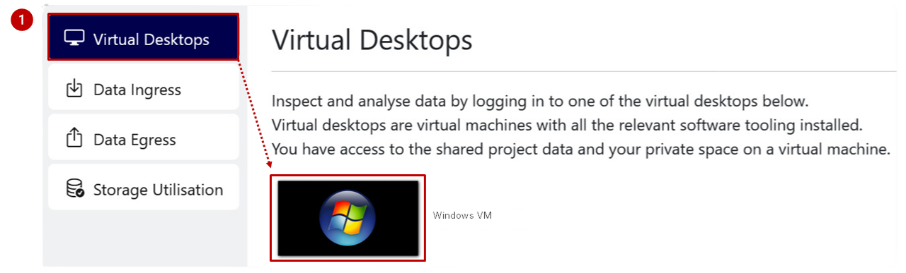
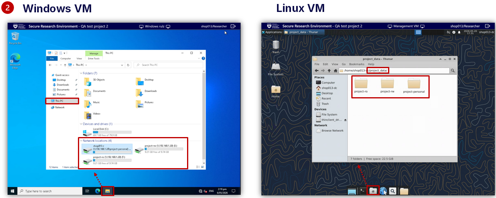
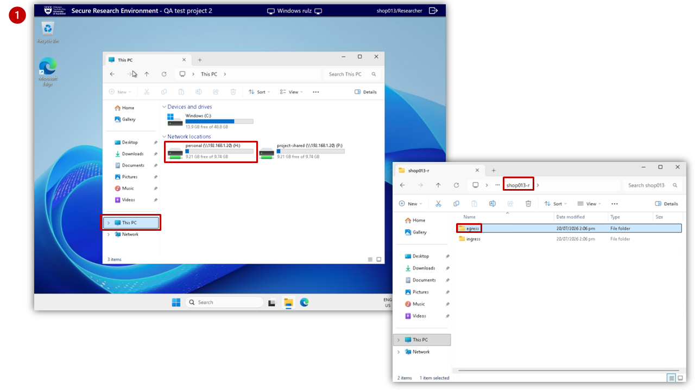
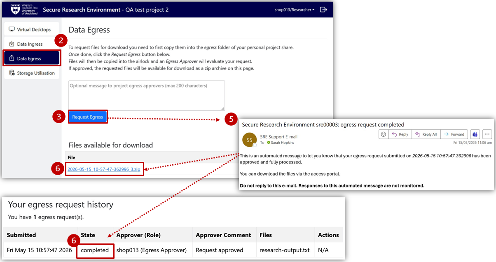

# As a Researcher

## Import data (Ingress Request)

As a researcher, use the **Ingress Request** to import files from your computer or a location outside of the Secure Research Environment.

### Create a new Ingress Request

<ol>
  <li>
    Select <strong>Data Ingress</strong> from the left-hand project menu
  </li>
  
  <li>
    Select <strong>Choose File</strong> to find a file from your computer
    

      You can zip up files to upload multiple files at once
    

  </li>
  
  <li>
    Once displayed, select <strong>Upload</strong> to copy your file to the staging area
    

      Review <strong>Storage Utilisation</strong> from the left-hand project menu, or in the bottom-right of the Project Dashboard, to confirm sufficient free storage space in the staging area and Project Storage.
        
      If you were partway through an Ingress Request and logged out after 15 minutes of inactivity, you will see a file upload failure notification prompting you to log in again.
    

  </li>
</ol>

<figure markdown>
  
  <figcaption> </figcaption>
</figure>

<ol start="4">
  <li>
    Select <strong>Request Ingress</strong>
    

      This moves the files into the stagin area. A notificaiton is sent to you and the Ingress Approver to evaluate your request, and you will see the request State in <strong>Your Ingress request history</strong> change from <em>creating</em> to <em>pending_approval</em>. All files are virus-scanned before being sent to the Ingress Approver for approval.
    

  </li>
  
  <li>
    Wait for the review process to complete.
  </li>
</ol>

<figure markdown>
  
  <figcaption> </figcaption>
</figure>

### Access files for analysis

<ol start="6">
  <li>
    If the Ingress Request is approved, you will receive an email notification, and the request State in <strong>Your Ingress request history</strong> will change from <em>pending_approval</em> to <em>completed</em>.
  </li>
</ol>

<figure markdown>
 
  <figcaption> </figcaption>
</figure>

<ol start="7">
  <li>
    The files will be moved into a timestamped folder within the <code>ingress</code> sub-folder of your personal storage folder (<code>username-r</code>). Access this folder from within the <code>personal</code> storage area.
    

      Keep the file in your personal folder or copy/move it into <code>project-rw</code> to share and collaborate with the rest of your team. You can access the <code>project-rw</code> folder within the <code>project-shared</code> storage area.
    

  </li>
</ol>
  
<figure markdown>
  
  <figcaption> </figcaption>
</figure>

If the Ingress Approver rejects your request, you will receive an email notification of the rejection, and you can contact the Ingress Approver for clarification. The request is marked as <em>rejected</em>, and the file is deleted from the staging area.
  
## Analyse data

Use a virtual desktop to access and work with project data on a secure VM.

<ol>
  <li>
    Choose <strong>Virtual Desktops</strong> from the left-hand project menu and select the <strong>Research VM</strong> (either Windows or Linux, as available).
  </li>
</ol>

<figure markdown>
  
  <figcaption> </figcaption>
</figure>

<ol start="2">
  <li>Access project data from the network folders.
    <ul>
      <li>
        <strong>Windows VM:</strong> Click on the File Explorer from the taskbar at the bottom of the virtual desktop. Select <strong>This PC</strong> to display available folders within "Network locations" to open the folder you want.
      </li>
      <li>
        <strong>Linux VM:</strong> Click on the File Manager from the taskbar at the bottom of the virtual desktop. Select <code>personal</code> or <code>project_shared</code> to display available folders.
        

          Personal folders, accessed within the <code>personal</code> storage area, are intended for individual use, while folders within the <code>project-shared</code> storage area enable collaboration across the project team.
        

      </li>
    </ul>
  </li>
</ol>

<figure markdown>
  
  <figcaption> </figcaption>
</figure>

<ol start="3">
  <li>
    Select your software from the desktop.
      

        If your software is not available on the desktop, click on the Search icon in the taskbar, type in and select the software you need.
      

  </li>
  
  <li>
    Once the analysis is complete, select <code>project-rw</code> or your personal folder (<code>username-r</code>) and press <strong>Save</strong> to save your output.
      

        As a researcher, you cannot save a file in the <code>project-ro</code> folder. 
        <strong>Saving your files to the VM's <code>Desktop</code> and <code>Documents</code> folders is not recommended, as VMs are replaceable and the files you save there could be lost.</strong>
      

  </li>
</ol>

## Export data (Egress Request)

As a researcher, use the <strong>Egress Request</strong> to download your data outputs to your local computer or a location outside of the Secure Research Environment.

### Create a new Egress Request

<ol>
  <li>
    Open your personal folder (<code>username-r</code>) on the virtual desktop and copy the file to be downloaded into the <code>egress</code> subfolder.
  </li>
</ol>

<figure markdown>
  
  <figcaption> </figcaption>
</figure>
  
<ol start="2">
  <li>
    Return to <strong>Data Egress</strong> from the left-hand project menu on the Project Dashboard.
  </li>
  
  <li>
    Select <strong>Request Egress</strong>
    

      This will copy any files from your <code>egress</code> sub-folder into the staging area (egress-approver folder) where an Egress Approver can review the files to ensure there are no identifiable or sensitive information. An email is sent to you and the Egress Approver to evaluate your request, and you will see the request State in <strong>Your egress request history</strong> change from <em>creating</em> to <em>pending-approval</em>.
    

  </li>

  <li>
    Wait for the review process to complete.
  </li>
</ol>

### Access files for download

<ol start="5">
  <li>
    If the Egress Request is approved, you will receive an email notification, and the request State in <strong>Your egress request history</strong> will change from <em>pending-approval</em> to <em>completed</em>.
  </li>

  <li>
    The files will be available for download. Click on the zip file under the <strong>Files available for download</strong>
  </li>

  <li>
    Go to your local computer's <code>Download</code> folder. Unzip the downloaded folder - with file(s) inside - and save to an appropriate location.
  </li>
</ol>

<figure markdown>
  
  <figcaption> </figcaption>
</figure>

If the request is rejected, contact the Egress Approver for further details.