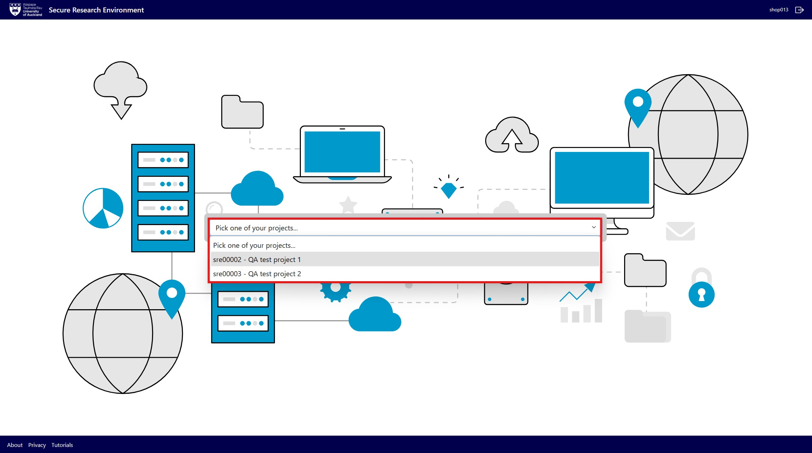

# Getting started

## Pre-requisites

You will need to complete the following steps to access the SRE:

<ol>
    <li>Complete the online sensitive data training and quiz</li>
    <li>Ensure you have the following access requirements:
        <ul>
            <li>University of Auckland username and password</li>
            <li>VPN access (required off-campus or outside the University of Auckland intranet)</li>
            <li>Internet connection and computer</li>
            <li>Supported web browser (Chrome, Edge, Firefox)</li>
            <li>Multi-factor authentication</li>
        </ul>
    </li>
</ol>

## Logging into the SRE

You can access the SRE by clicking [here](http://www.sre.auckland.ac.nz/) or entering the following URL:

```
http://www.sre.auckland.ac.nz/
```

To log in:

<ol>
    <li>Sign in with your University of Auckland username and password</li>
    <li>Enter your Two-Factor Authentication code</li>
    <li>Once logged in, you will be directed to the SRE landing page</li>
    <li>Select a project from the drop-down menu
        <div style="border-left: 4px solid #00caef; padding-left: 12px;">
        All projects you have access to will be displayed in the drop-down.
        </div>
    </li>
</ol>


<figure markdown>
  
  <figcaption> </figcaption>
</figure>

## SRE Landing Page

The main elements of the SRE landing page are shown below.

<figure markdown>
  
  <figcaption> </figcaption>
</figure>

<ol>
    <li>Displays the username of the logged in user</li>
    <li>Log out of the SRE</li>
    <li>Project selection drop-down menu</li>
    <li>SRE information page</li>
    <li>Privacy policy</li>
    <li>SRE user guide</li>
</ol>

## Project Dashboard
The main elements of the project dashboard are shown below.

<figure markdown>
  
  <figcaption> </figcaption>
</figure>

<ol>
    <li>Click on Secure Research Environment to switch projects (returns you to the SRE landing page)</li>
    <li>Displays the name ofthe open project</li>
    <li>Use the left-hand navigation to toggle between SRE activities, depending on your project role</li>
    <li>Minimise the left-hand project menu</li>
    <li>Displays the logged-in account and current project role
        <div style="border-left: 4px solid #00caef; padding-left: 12px;">
        If you have more than one project role, you can switch between roles by selecting an option from this drop-down menu.
        </div>
    </li>
    <li>Log out of the SRE</li>
    <li>Project storage utilisation (quick view)
        <div style="border-left: 4px solid #00caef; padding-left: 12px;">
        Select Storage Utilisation from the left-hand project menu to display full storage use and quota information.
        </div>
    </li>
</ol>